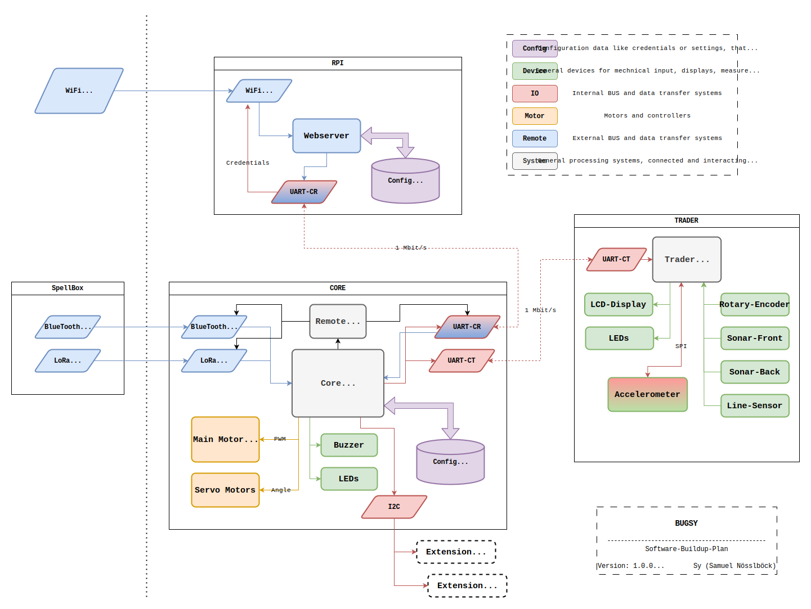

# Code

    

The Bugsy software is split upon multiple controllers and different client programs.

### Components table for version 0.1.0/2024/11/28

- Controllers
  - [**CORE**](bugsy_core/README.md)
  - [**TRADER**]()
  - [**RPI**]()
- Remotes
  - Bluetooth: Main remote control method
  - LoRa: Alternative control method for future releases
  - WiFi: High data transfer control method for camera and more
- Clients
  - bug_magic: 